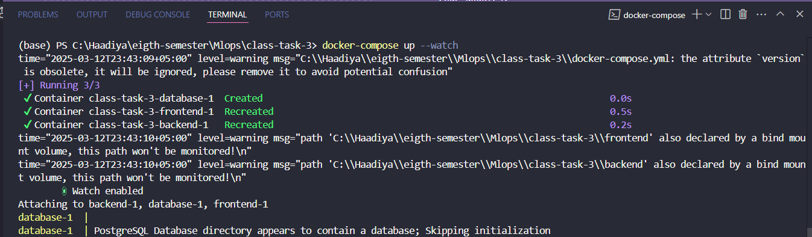

# Weather App (Docker-based Full-Stack Application)

A simple, containerized weather application built with React, Node.js, Express, and PostgreSQL. This project demonstrates Docker containerization with separate services for frontend, backend, and database.

## Features

- Weather lookup by city name
- Recent search history tracking
- Real-time code updates with watch mode
- Containerized with Docker and orchestrated with Docker Compose

## Prerequisites

- [Docker](https://docs.docker.com/get-docker/) 
- [Docker Compose](https://docs.docker.com/compose/install/)
- [OpenWeatherMap API key](https://openweathermap.org/api) (free tier)

## Project Structure

```
weather-app/
├── frontend/           # React application
├── backend/            # Node.js/Express API
├── database/           # PostgreSQL database
└── docker-compose.yml  # Container orchestration
```

## Quick Start

1. Clone this repository:
   ```
   git clone http://github.com/haadiyeah/class-task-3
   cd class-task-3
   ```

2. Get a free API key from [OpenWeatherMap](https://openweathermap.org/api)

3. Update the API key in `docker-compose.yml`:
   ```yaml
   WEATHER_API_KEY= ....
   ```

4. Build and start the containers:
   ```
   docker-compose up
   ```

5. Access the application:
   - Frontend will be on: http://localhost:3000
   - Backend API: http://localhost:4000

## App Images and Screenshots
Application running on frontend:


Running the docker-compose up command: The output should look like this:



## Development

The application is configured for development with real-time code updates:

- Frontend changes will trigger React's hot-reloading
- Backend changes will restart the Node.js server (via Nodemon)
- Database data persists between restarts using a Docker volume

## Docker Commands

- Start the application:
  ```
  docker-compose up
  ```

- Start in detached (background) mode:
  ```
  docker-compose up -d
  ```

- View logs:
  ```
  docker-compose logs -f
  ```

- Stop the application:
  ```
  docker-compose down
  ```

- Rebuild containers after making changes to Dockerfiles:
  ```
  docker-compose up --build
  ```

## API Endpoints

- `GET /api/weather?city={cityName}` - Get weather for a specific city
- `POST /api/save-search` - Save a city search to history
- `GET /api/recent-searches` - Get list of recent searches

## Stopping the Application

To stop the application:

```
docker-compose down
```

To remove all containers and data volume:

```
docker-compose down -v
```

## Troubleshooting

- If the frontend can't connect to the backend, make sure the environment variable `REACT_APP_API_URL` in docker-compose.yml is correctly set.
- If the backend can't connect to the database, check the database environment variables in docker-compose.yml.
- If you receive an error from the weather API, verify your API key is correct and the rate limits haven't been exceeded.


